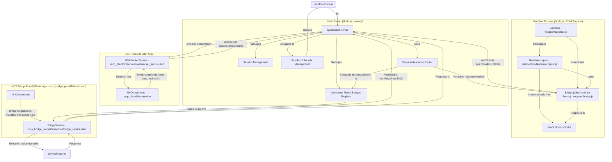
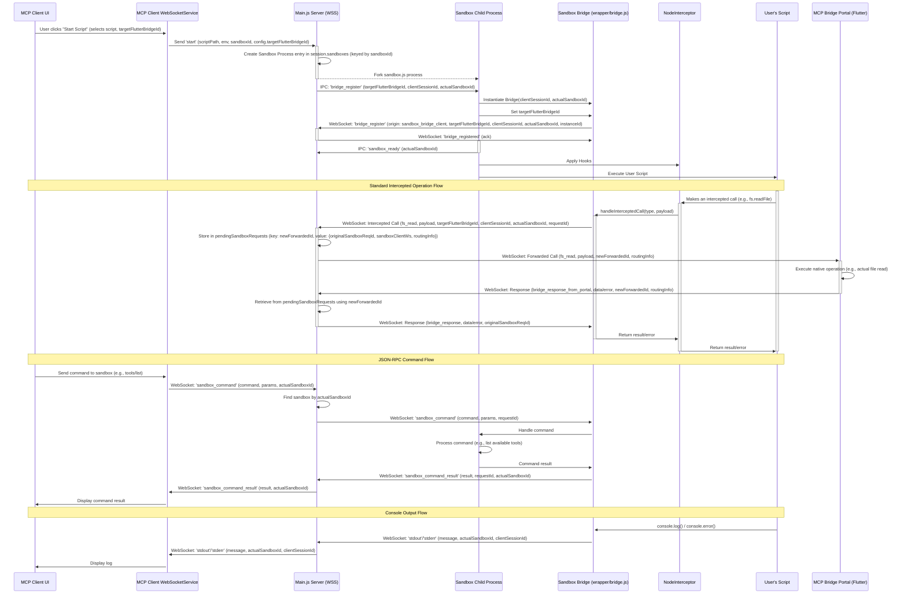

# MCP Wrapper

A secure sandbox system for running MCP servers with controlled resource access and system isolation.

## Core Concept

MCP Wrapper creates a secure execution environment where MCP servers operate with restricted permissions. The architecture:

1. **Intercepts system calls** from MCP servers
2. **Redirects operations** through an authenticated bridge portal
3. **Controls access** to network, file system, and system resources

This allows running MCP servers in isolated environments while still providing necessary capabilities through secure, authenticated channels.

## Architecture Components

### Main Server

- Central WebSocket server that manages sandbox environments
- Handles bridges registration and authentication
- Manages communication between components
- Controls sandbox lifecycle (create, run, terminate)

### MCP Client

- Management interface for the entire system
- Controls MCP server instances
- Generates bridge authentication tokens
- Monitors running sandboxes
- Sends commands to sandbox instances
- Views output and responses

### Bridge Portal

- Privileged intermediary for secured operations
- Handles actual network requests, file access, and system commands
- Can have multiple instances with different capabilities
- Only one active bridge at a time (determined by environment)
- Connects to main server using secure authentication tokens

### Sandbox Environment

- Isolated execution context for MCP servers
- Intercepts all system calls and external interactions
- Redirects operations to the active bridge portal
- Prevents direct access to host system

## Features

- Complete file system isolation
- Multi-language support (Node.js and Python)
- Customizable environment variables
- Path virtualization (conversion of system paths to virtual paths)
- Prevention of access outside the sandbox
- Blocking of unauthorized network access
- Bridge authentication via secure tokens
- Multiple bridge support with environment-based activation

## Installation

```bash
npm install
```

## Usage

To run the tests:

```bash
npm run start
```

## Communication Flow

1. **MCP Client** connects to Main Server
2. Client generates authentication tokens for Bridge Portal
3. **Bridge Portal** connects to Main Server using token
4. Client starts MCP server in **Sandbox Environment**
5. Sandboxed MCP server executes with restricted permissions
6. When MCP server needs privileged access:
   - Request is intercepted by wrapper
   - Request is forwarded to active Bridge Portal
   - Bridge Portal performs operation with proper permissions
   - Results are returned to sandboxed MCP server

## Project Structure

- `/server`: Main server code
- `/wrapper`: Sandbox and wrapper code
- `/mount`: Virtual mount point for scripts
- `/mcp_client`: Flutter control interface for the system
- `/mcp_bridge_portal`: Flutter application for privileged access bridge

## Security Benefits

- **Isolation**: MCP servers cannot directly access host system
- **Access Control**: All privileged operations pass through authenticated bridge
- **Environment Separation**: Different bridges can provide different capabilities
- **Token Authentication**: Only authorized bridges can connect
- **Operation Auditing**: All bridge operations can be monitored and logged

## Tests

The project includes tests for:

- File operations in Node.js
- File operations in Python
- Security restriction tests
- HTTP request tests
- Bridge authentication and communication

## System Architecture Diagram (Mermaid)



## Operational Flow Diagram (Mermaid)


